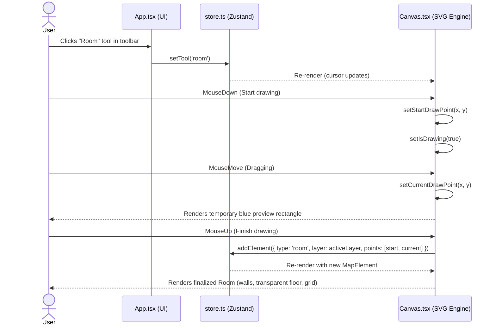
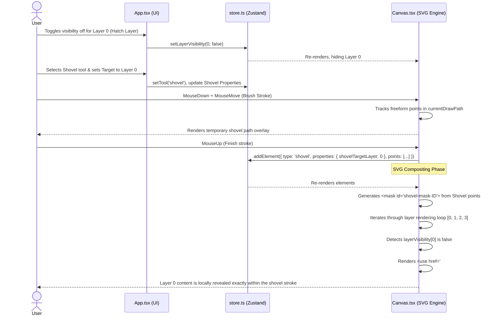

# Dread Dungeon Tile Creator - Design Document

## Description of the Application
The Dread Dungeon Tile Creator is a specialized web-based map-making tool designed for tabletop role-playing games (TTRPGs). It enables users to rapidly generate dungeon tiles with a hand-drawn, old-school aesthetic, specifically utilizing "Dyson-style" procedural hatching. The tool provides a robust SVG-based canvas that natively supports overlapping elements, complex layer masking, custom pattern creation, and a suite of architectural drawing tools. 

## Features
- **Architectural Tools**: Draw Rooms, Interiors, Walls, standard Doors, Double Doors, Secret Doors, and Stairs.
- **Layer System**: Four distinct drawing layers tailored for dungeon creation:
  - **Hatch Layer (Layer 0)**: Dedicated to exterior hatch patterns.
  - **Floor Layer (Layer 1)**: Intended for custom floor graphics, background images, and tiles.
  - **Room Layer (Layer 2)**: The primary layer for drawing the physical structure of the dungeon.
  - **Layer 3**: Additional overlay layer.
- **Advanced Masking Engine**: 
  - Rooms have transparent floors allowing the Floor Layer to shine through.
  - Global anti-room masking prevents Hatch Layer exterior patterns from bleeding into the interior rooms.
- **Brush & Shovel Tools**:
  - **Brushes**: Draw freeform paths with various shapes (Round, Splat, Asterisk, Pentagon) and tunable smoothness to add organic details.
  - **Shovel**: A unique masking tool that allows the user to "dig" through higher layers to expose specifically targeted lower layers (e.g., exposing the Hatch Layer through the Room Layer).
- **Procedural Hatching**: Automatically generates "Dyson-style" cross-hatching around the exterior perimeters of all drawn rooms. Supports organic edge boundaries and soft borders.
- **Pattern Editor**: An embedded editor to hand-draw and save custom hatch patterns for use in the main map canvas.
- **Decorations**: Place geometric shapes (Squares, Circles, Rectangles) for mapping out props, traps, and pillars.
- **Exporting**: Export user-defined selected regions or the entire tile canvas as an SVG.
- **Custom Graphics**: Upload external SVG images to populate map layers.
- **Dynamic Shadows & Grid**: Configurable shadow thickness/intensity and a toggleable grid that applies globally to both exteriors and room interiors.

## Technology Stack
- **Framework**: React 19
- **State Management**: Zustand
- **Styling**: Tailwind CSS v4
- **Bundler / Tooling**: Vite
- **Icons**: Lucide React
- **Graphics Engine**: Native HTML5 `<svg>` with declarative React rendering.

## File Structure

- **`/src/App.tsx`**
  - **Description**: The primary UI layout wrapper. It mounts the main workspace, the left-hand toolbars (for selecting drawing tools like Room, Wall, Brush, etc.), and the right-hand properties panel (for managing Layers, Shadow Properties, Tool Settings, and Global Configs).
- **`/src/components/Canvas.tsx`**
  - **Description**: The core SVG rendering engine of the application. It handles mouse events (drawing, selecting, panning), translates `MapElement` data into SVG primitives (`<rect>`, `<line>`, `<path>`, `<use>`), and orchestrates the complex layer compositing and masking system (e.g., `global-room-mask`, `shovel-mask`, `anti-room-mask`).
- **`/src/components/PatternEditor.tsx`**
  - **Description**: A standalone UI component embedded in the main app that provides a mini-canvas for drawing custom 8x8 hatch patterns. These patterns can be saved into the global state and subsequently used as fills on the main canvas.
- **`/src/store.ts`**
  - **Description**: The global Zustand state store. It holds the canonical source of truth for the application, including the array of `elements` (lines, rooms, brushes), `viewState` (camera pan/zoom), active `tool`, global `layerVisibility`, and various visual properties (shadows, brush width, hatch thickness).
- **`/src/utils/dysonGenerator.ts`**
  - **Description**: A utility module containing the algorithmic logic for procedural hatching. It calculates orthogonal bounding boxes around drawn elements and generates the short, angled line segments characteristic of Dyson-style mapping.
- **`/src/main.tsx`**
  - **Description**: The standard React DOM entry point that mounts the `<App />` component into the HTML `root`.
- **`/src/index.css` & `/src/App.css`**
  - **Description**: Global stylesheets loading Tailwind CSS directives and custom utility classes.

---

## Interaction Flows

### Drawing a Room Element

This sequence diagram illustrates the event flow when a user selects the Room tool and draws a new room on the canvas.

### Using the Shovel Tool to Expose a Hidden Layer

This sequence diagram illustrates the complex masking logic triggered when the user hides a layer and utilizes the Shovel tool to dig through the canvas to reveal it.

